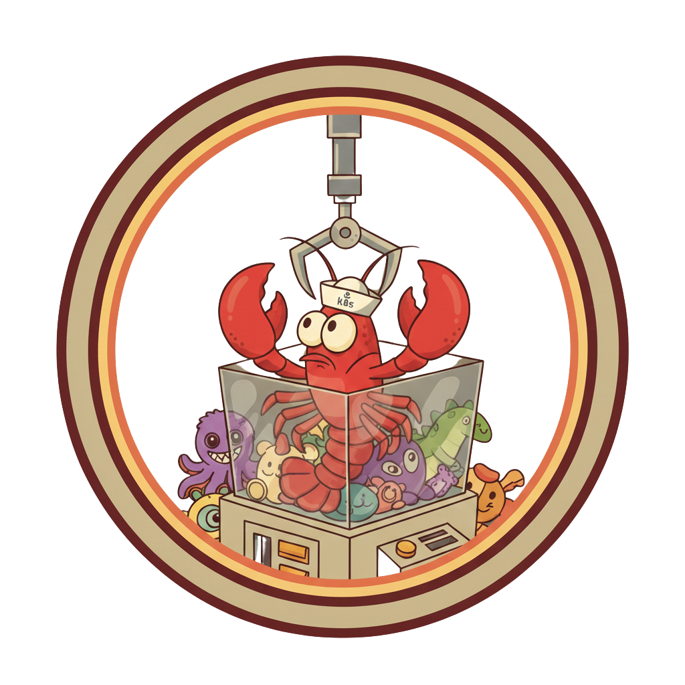

<div align="center">
  
  <h1>ClawMachine</h1>
  <p>Kubernetes-native dashboard for deploying and operating AI bots. One Helm install. One dashboard. Full control.</p>

  <!-- gif goes here -->

</div>

---

> [!WARNING]
> The Claw Machine is in a _prerelease_ state. Expect bugs, breaking changes, and incomplete features. I've done my best to make it secure, but as with anything with Claw-adjacent proceed with caution. I'm actively using and dogfooding it, and will be pushing updates frequently. Feedback is very welcome!

## What it does

ClawMachine is the operations layer for running [OpenClaw](https://github.com/openclaw/openclaw) and other AI bots on Kubernetes. Install it once, then deploy, monitor, and manage bots through a single dashboard.

The control plane runs as a Helm chart in your cluster. Bots run in isolated pods. Everything stays on your infrastructure.

## Supported Bots

| Bot                                              | Status         | Description                                                  |
| ------------------------------------------------ | -------------- | ------------------------------------------------------------ |
| [OpenClaw](https://github.com/openclaw/openclaw) | ✅ Recommended | Multi-channel personal AI assistant. Primary supported path. |
| IronClaw                                         | ⚠️ Beta        | Privacy-first Rust bot by NEAR AI with WASM sandboxing.      |
| PicoClaw                                         | ⚠️ Beta        | Lightweight Go bot for health checks and simple automations. |

## Key Features

**Container isolation** — Each bot runs in its own Kubernetes pod with dedicated resource limits and a strict security context.

**Network isolation** — Kubernetes NetworkPolicy (optionally) locks down egress. Configure per-bot domain allow lists so bots only reach exactly what they need.

**1Password secrets** — Secrets sync directly from your 1Password vault into Kubernetes via External Secrets Operator. Only allow your bots access what they need.

**Automated backups** — Schedule recurring backups of bot workspace data to S3. Restore on startup, or perform a brain transplant to a new bot with one checkbox.

**Live telemetry** — Real-time pod logs, network flow observability, CLI access, config and health. — all in the dashboard.

## Quick Start

```bash
curl -fsSL https://theclawmachine.dev/install.sh | bash
clawmachine install --namespace claw-machine
kubectl port-forward -n claw-machine svc/clawmachine 8080:80
```

Open `http://localhost:8080` and follow the setup wizard.

## CLI

```bash
clawmachine install      # install ClawMachine into your cluster
clawmachine serve        # run the control plane locally (dev mode)
clawmachine upgrade      # upgrade ClawMachine in-cluster
clawmachine uninstall    # remove ClawMachine from the cluster
clawmachine doctor       # check cluster health and prerequisites
clawmachine status       # show status of all managed releases
clawmachine backup       # trigger a manual workspace backup
clawmachine restore      # restore workspace from a backup
clawmachine version      # print version info
```

## Local Development

```bash
mise trust && mise install   # install tools via mise
mise run charts              # package Helm charts for go:embed
mise run test                # run Go tests
mise run docs:serve          # serve the docs site locally
```

See [docs/content/docs/development.md](docs/content/docs/development.md) for the full local setup guide.

## Docs

Full documentation at **[theclawmachine.dev](https://theclawmachine.dev)**.

- [Getting Started](https://theclawmachine.dev/docs/getting-started)
- [Compatibility](https://theclawmachine.dev/docs/compatibility)
- [Bot Management](https://theclawmachine.dev/docs/bots)
- [Secrets Management](https://theclawmachine.dev/docs/secrets)
- [Network Security](https://theclawmachine.dev/docs/network-security)
- [Roadmap](https://theclawmachine.dev/docs/roadmap)

## Contributing

**Bug or issue?** [Open a GitHub issue](https://github.com/zackerydev/theclawmachine/issues/new)
**Question or idea?** [Start a GitHub discussion](https://github.com/zackerydev/theclawmachine/discussions)

## License

MIT
