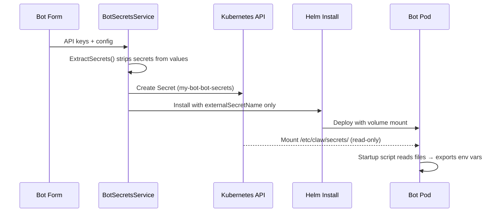

This guide covers how ClawMachine handles API keys and tokens you enter in the bot creation form — no external vault required.

## How It Works

When you create a bot and fill in secret fields (API keys, tokens), ClawMachine:

1. **Strips secrets** from the Helm values before installation
2. **Creates a Kubernetes Secret** directly via the K8s API (`{release}-bot-secrets`)
3. **Volume-mounts** the secret into the pod at `/etc/claw/secrets/` (read-only, `0400`)
4. The bot's startup script reads files → exports as process-local env vars

Your secrets never touch Helm release history or etcd release objects.

## Step 1: Create a Bot with Secrets

1. Navigate to **Install** and select a bot type (e.g., OpenClaw)
2. Fill in the **Release Name** and configuration
3. Enter API keys in the secrets section:
   - **Anthropic API Key** — for Claude models
   - **Discord Token** — for Discord channel integration
   - Any other provider-specific keys
4. Click **Install**

ClawMachine handles the rest — secrets go to K8s API, everything else goes through Helm.

## Step 2: Verify Secrets Are Mounted

Shell into the bot pod and check the mount:

```bash
kubectl exec -it deploy/my-bot-openclaw -n clawmachine -- ls -la /etc/claw/secrets/
```

You should see files like:

```
-r-------- 1 root root 56 Feb 17 15:00 ANTHROPIC_API_KEY
-r-------- 1 root root 72 Feb 17 15:00 DISCORD_TOKEN
```


The files are `0400` (read-only by owner). They won't show up in `kubectl describe pod` or `docker inspect` — only inside the running container's filesystem.


## Step 3: Update Secrets

To rotate a key:

```bash
kubectl patch secret my-bot-bot-secrets -n clawmachine \
  -p '{"data":{"ANTHROPIC_API_KEY":"'"$(echo -n 'sk-new-key' | base64)"'"}}'
```

Kubernetes automatically updates the mounted volume (within ~1 minute). The bot picks up the new value on next restart, or immediately if the startup script is re-run.

Alternatively, uninstall and reinstall the bot from the UI with new values.

## How Secrets Flow



## Cleanup

When you uninstall a bot from ClawMachine, the associated `bot-secrets` Secret is automatically deleted. No orphaned secrets left behind.

## When to Use 1Password Instead

Use the [1Password integration](../secrets-with-1password) when you want:

- **Automatic rotation** — ESO syncs on a schedule
- **Centralized vault** — one source of truth across clusters
- **Audit trail** — 1Password logs all access

Use **bot secrets** (this guide) when you just need to get a bot running with an API key and don't have an external vault set up.
